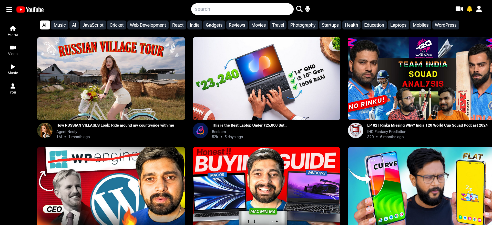
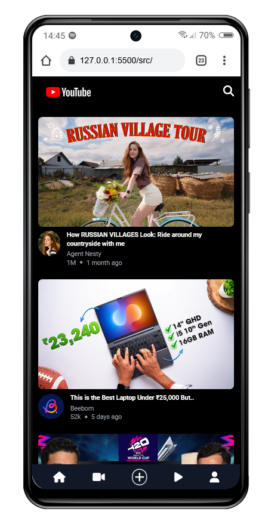
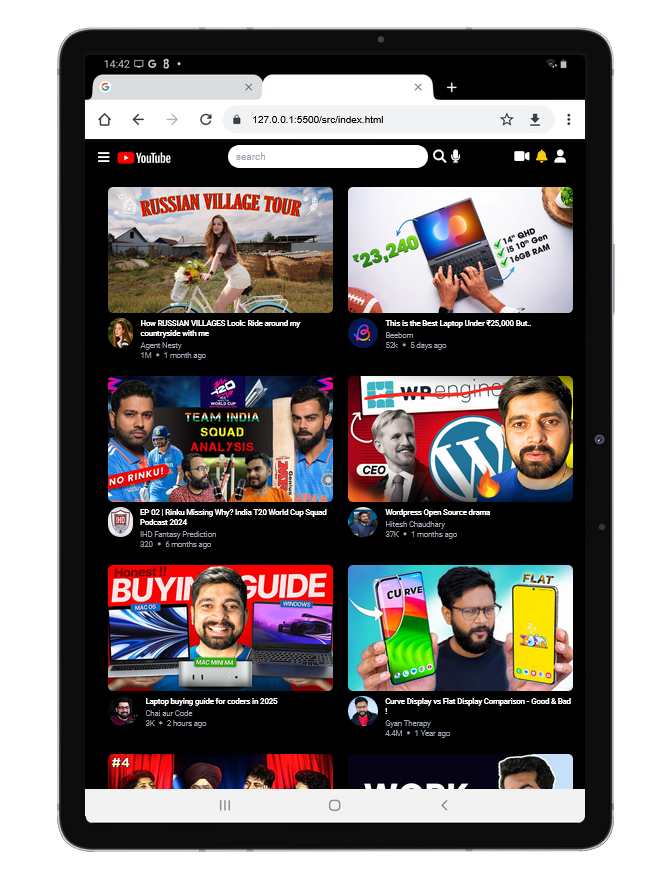

# YouTube Clone

A responsive and dynamic clone of the YouTube interface built using **HTML**, **CSS (Tailwind CSS)**, and **JavaScript**. This project features a functional navbar, sidebar, dynamic content cards, and responsive design to provide a seamless user experience.

## Features

- **Responsive Design**: Adapts to various screen sizes, including mobile, tablet, and desktop views.
- **Navbar**: Fixed top navigation bar with a search bar, microphone, and user options.
- **Sidebar**: Fixed sidebar for quick navigation, visible on larger screens.
- **Quick Topics**: A row of scrollable topic buttons for filtering content categories.
- **Dynamic Content**: JavaScript dynamically generates video cards with data such as title, channel name, views, and upload date.
- **Footer**: Mobile-friendly footer navigation for easier access.

## Technologies Used


### 🖥️ Desktop View

<div style="display: flex; justify-content: space-around; align-items: center;">
  
</div>

### 📱 Mobile and Tablet View

<div style="display: flex; justify-content: space-around; align-items: center;">
  
    
</div>

## 🚀 How to Use

1. Clone this repository to your local machine:
   ```bash
   git clone https://github.com/abhishekthakur797/youtube-clone.git
   ```

## ⭐ Support

If you found this project helpful or inspiring, please consider giving it a ⭐ on GitHub and following me for more exciting projects! Your support means a lot and keeps me motivated. 😊
